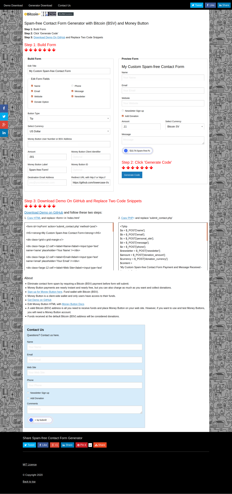

# Spam-free Contact Form Generator with Bitcoin (BSV) and Money Button

<a href="https://github.com/Iowercase-I/spam-free-contact-form-generator">**Download Contact Form Generator Here**</a>  
<a href="https://github.com/Iowercase-I/spam-free-contact-form">**Download Contact Form Demo Here**</a>  
<ul>
  <li>Eliminate contact form spam by requiring a Bitcoin (BSV) payment before form will submit.</li>
  <li>Money Button payments are nearly instant and nearly free, but you can also charge as much as you want and collect donations.</li>
  <li><a href="https://www.moneybutton.com/">Sign-up for Money Button here</a>. Fund wallet with Bitcoin (BSV).</li>
  <li>Money Button is a client-side wallet and only users have access to their funds.</li>
  <li>Edit Money Button HTML with <a href="https://docs.moneybutton.com/">Money Button Docs</a></li>
  <li>A valid Bitcoin (BSV) address is all you need to receive funds and place Money Button on your web site. However, if you want to use and test Money Buttons, you will need a Money Button account.</li>
  <li>Funds received at the default Bitcoin (BSV) address will be considered donations.</li>
</ul>

Created with:
------------------------------------

<a href="https://www.moneybutton.com/">**Money Button**</a> 
<a href="https://bitcoinsv.io/">**Bitcoin SV**</a> 
<a href="https://foundation.zurb.com/">**Zurb Foundation 6**</a> 

MIT License:
----------------
Copyright (c) 2020 Iowercase-I

Permission is hereby granted, free of charge, to any person obtaining a copy
of this software and associated documentation files (the "Software"), to deal
in the Software without restriction, including without limitation the rights
to use, copy, modify, merge, publish, distribute, sublicense, and/or sell
copies of the Software, and to permit persons to whom the Software is
furnished to do so, subject to the following conditions:

The above copyright notice and this permission notice shall be included in all
copies or substantial portions of the Software.

THE SOFTWARE IS PROVIDED "AS IS", WITHOUT WARRANTY OF ANY KIND, EXPRESS OR
IMPLIED, INCLUDING BUT NOT LIMITED TO THE WARRANTIES OF MERCHANTABILITY,
FITNESS FOR A PARTICULAR PURPOSE AND NONINFRINGEMENT. IN NO EVENT SHALL THE
AUTHORS OR COPYRIGHT HOLDERS BE LIABLE FOR ANY CLAIM, DAMAGES OR OTHER
LIABILITY, WHETHER IN AN ACTION OF CONTRACT, TORT OR OTHERWISE, ARISING FROM,
OUT OF OR IN CONNECTION WITH THE SOFTWARE OR THE USE OR OTHER DEALINGS IN THE
SOFTWARE.
